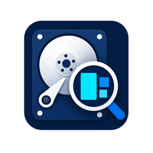

# DiskAnalyzer



## 磁盘满了，却找不到真正占空间的大文件？

你是否也遇到过这些情况：

- C 盘空间不足，却不知道应该清理什么；
- 逐级打开文件夹，只看到大量零散小文件；
- 明明占用了几十 GB，却始终找不到真正的“大户”；
- 想快速清理磁盘，却把时间浪费在手动翻找目录上。

**DiskAnalyzer 只做一件事：扫描整个磁盘，把所有真实文件按大小排列，让你直接看到最大的文件在哪里、占用了多少空间。**

> 选择磁盘，点击扫描，一分钟定位最占空间的大文件。

它面向 Windows 10/11，不按照文件夹汇总，也不隐藏在复杂图表后面。扫描完成后，最大的文件会直接出现在列表顶部，并且可以一键打开所在位置。

[立即下载最新 Windows x64 版本](https://github.com/Terzo050818/DiskAnalyzer/releases/latest)

## 普通用户下载

不需要下载源码，也不需要安装 Visual Studio。

1. 在 GitHub 项目页面右侧点击 **Releases**；
2. 下载最新版 `DiskAnalyzer-版本号-win-x64.zip`；
3. 解压 ZIP；
4. 解压后的文件夹根目录只有一个 `DiskAnalyzer.exe`；
5. 双击 `DiskAnalyzer.exe` 即可使用。

当前版本也可以直接下载：

[DiskAnalyzer-0.1.2-win-x64.zip](https://github.com/Terzo050818/DiskAnalyzer/releases/download/v0.1.2/DiskAnalyzer-0.1.2-win-x64.zip)

## MVP 功能

- 显示固定磁盘、总容量和剩余空间；
- 后台扫描整个磁盘，界面保持响应；
- 实时显示当前路径、文件数、累计大小和跳过项；
- 自动跳过无权限或扫描期间失效的文件系统项；
- 显示文件名、完整路径、大小、类型和修改时间；
- 扫描完成后按大小降序；
- 通过资源管理器打开文件所在位置；
- 支持随时取消扫描。

## 使用发布包

1. 解压 `DiskAnalyzer-0.1.2-win-x64.zip`；
2. 双击 `DiskAnalyzer.exe`；
3. 选择磁盘并点击“开始扫描”；
4. 扫描结束后，最大的文件位于列表顶部；
5. 选择文件后点击“打开文件位置”，或使用右键菜单。

发布包为 Windows x64 自包含版本，不要求目标电脑预先安装 .NET。

软件当前未进行代码签名，首次运行时 Windows SmartScreen 可能显示未知发布者提示。请只运行来自可信构建来源且 SHA-256 校验一致的文件。

## 从源码构建

要求：

- Windows 10/11 x64；
- .NET 8 SDK；

```powershell
dotnet restore DiskAnalyzer.sln --configfile NuGet.Config
dotnet build DiskAnalyzer.sln --configuration Release
dotnet test DiskAnalyzer.sln --configuration Release
```

生成自包含发布包：

```powershell
.\scripts\publish.ps1
```

输出位于 `artifacts`。

## 当前限制

- MVP 不支持删除、搜索、排除目录、重复文件或缓存识别；
- 不主动申请管理员权限，无权访问的目录会跳过；
- 全部文件元数据保留在内存中，百万文件场景可能占用较多内存；
- 扫描完成时的全量排序可能短暂占用 UI 线程；
- 目录联接点和目录符号链接默认不向下遍历，以避免循环和重复扫描。

架构和性能说明参见：

- [架构设计](docs/ARCHITECTURE.md)
- [性能验证](docs/PERFORMANCE.md)
