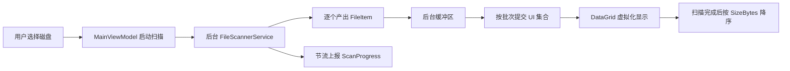

# DiskAnalyzer 架构设计（Step 1）

## 1. 产品定位与第一版边界

DiskAnalyzer 是一个面向 Windows 10/11 的本地磁盘大文件定位工具。

第一版 MVP 只解决一个核心问题：

> 选择一个磁盘后，快速找出其中最大的真实文件，并能打开文件所在位置。

### MVP 包含

- 枚举当前计算机中的固定磁盘；
- 显示盘符、总容量、已用空间、剩余空间；
- 选择盘符并开始、取消扫描；
- 后台递归扫描真实文件，UI 保持可操作；
- 跳过无权限、路径失效等异常项，扫描不中断；
- 实时显示当前路径、已发现文件数、已扫描文件总大小和跳过数；
- 显示文件名、完整路径、大小、类型、修改时间；
- 默认按文件大小从大到小排列；
- 从列表中打开文件所在文件夹并选中文件。

### MVP 暂不包含

- 删除文件和删除保护；
- 搜索及多种排序方式；
- 深浅色主题切换；
- 饼图、Treemap 等可视化；
- 重复文件查找；
- 缓存识别与清理建议；
- 排除目录配置；
- 管理员提权；
- 扫描结果持久化。

这些能力保留扩展点，待 MVP 的扫描正确性和大数据量性能验证通过后逐步加入。

## 2. 技术选择

- UI：WPF
- 运行时：.NET 8，目标框架 `net8.0-windows`
- 架构：MVVM
- 语言：C#
- 首版依赖策略：优先使用 .NET/WPF 自带能力，减少第三方依赖

选择 WPF 的原因：

- 与 Windows 文件系统、资源管理器和磁盘 API 集成直接；
- 不需要携带浏览器运行时，发布体积和内存开销小于 Electron；
- C# 的异步流、取消令牌和强类型模型适合实现可取消的长时间扫描；
- .NET 8 可使用现代文件枚举 API，并拥有长期维护基础。

## 3. 解决方案结构

```text
DiskAnalyzer/
├── DiskAnalyzer.sln
├── src/
│   └── DiskAnalyzer.App/
│       ├── DiskAnalyzer.App.csproj
│       ├── App.xaml
│       ├── Models/
│       │   ├── DriveItem.cs
│       │   ├── FileItem.cs
│       │   ├── ScanProgress.cs
│       │   └── ScanSummary.cs
│       ├── Services/
│       │   ├── IDriveService.cs
│       │   ├── DriveService.cs
│       │   ├── IFileScannerService.cs
│       │   ├── FileScannerService.cs
│       │   ├── IFileLocationService.cs
│       │   └── FileLocationService.cs
│       ├── ViewModels/
│       │   ├── ViewModelBase.cs
│       │   └── MainViewModel.cs
│       ├── Views/
│       │   ├── MainWindow.xaml
│       │   └── MainWindow.xaml.cs
│       ├── Commands/
│       │   ├── RelayCommand.cs
│       │   └── AsyncRelayCommand.cs
│       ├── Converters/
│       │   └── FileSizeConverter.cs
│       └── Resources/
│           ├── Colors.xaml
│           └── Styles.xaml
└── tests/
    └── DiskAnalyzer.Tests/
        ├── DiskAnalyzer.Tests.csproj
        ├── FileScannerServiceTests.cs
        └── FileSizeConverterTests.cs
```

首版使用一个应用项目和一个测试项目，避免在 MVP 阶段过度拆分程序集。目录边界已经明确，后续若扫描引擎需要复用，再将 Models/Services 抽成独立类库。

## 4. 核心模型

### DriveItem

- `Name`：盘符，如 `C:\`
- `VolumeLabel`
- `TotalBytes`
- `FreeBytes`
- `UsedBytes`：由总容量减剩余容量计算
- `IsReady`

### FileItem

- `Name`
- `FullPath`
- `SizeBytes`
- `Extension`
- `CreationTime`
- `LastWriteTime`

模型只保存原始字节数，不在模型中保存 `"10 GB"` 之类的格式化字符串。显示层通过转换器格式化，确保排序始终使用 `long` 数值而不是文本。

### ScanProgress

- `CurrentPath`
- `FilesDiscovered`
- `BytesDiscovered`
- `SkippedItems`
- `Elapsed`

### ScanSummary

- `FilesDiscovered`
- `BytesDiscovered`
- `SkippedItems`
- `Elapsed`
- `WasCancelled`

## 5. 模块职责

### DriveService

- 使用 `DriveInfo.GetDrives()` 获取磁盘；
- MVP 默认只展示 `DriveType.Fixed` 且已就绪的磁盘；
- 单个磁盘信息读取失败时跳过，不影响应用启动。

### FileScannerService

- 接收根路径和 `CancellationToken`；
- 在后台执行文件系统遍历；
- 持续产出文件结果和轻量级进度快照；
- 对单个目录或文件的权限、路径过长、文件消失等异常做局部隔离；
- 不直接引用 WPF 类型，不操作 UI 集合。

建议接口形态：

```csharp
IAsyncEnumerable<FileItem> ScanAsync(
    string rootPath,
    IProgress<ScanProgress> progress,
    CancellationToken cancellationToken);
```

### FileLocationService

- 使用 `explorer.exe /select,"完整文件路径"` 打开资源管理器；
- 调用前验证路径仍然存在；
- 负责命令行参数封装，ViewModel 不直接启动进程。

### MainViewModel

- 维护磁盘列表、所选磁盘、文件列表和扫描状态；
- 提供加载磁盘、开始扫描、取消扫描、打开位置命令；
- 批量接收扫描结果并定时提交到 UI；
- 扫描完成后触发默认大小降序视图。

### MainWindow

- 只负责布局、绑定和少量纯视图行为；
- 不包含文件扫描、排序或进程启动业务逻辑。

## 6. 扫描数据流



关键原则是扫描线程不逐文件调用 UI Dispatcher。每发现一个文件就刷新界面会在百万文件场景产生大量跨线程调度，使扫描速度和 UI 响应都明显下降。

## 7. 性能设计

### 7.1 第一版扫描策略

第一版使用迭代式目录遍历：

- 用显式栈或队列保存待扫描目录，避免深层目录导致递归调用栈溢出；
- 对每个目录使用惰性枚举；
- 每个目录单独捕获异常；
- 定期检查取消令牌；
- 结果进入有界或可控大小的批次缓冲区；
- UI 每批加入一组结果，而不是逐条加入。

### 7.2 关于“并行扫描”

不在第一版直接无限并行遍历目录。机械硬盘上大量随机访问可能比顺序枚举更慢，SSD 上无上限并发也会造成句柄、线程池和内存压力。

性能优化阶段再引入“有界并发”：

- HDD 默认并发度较低；
- SSD 可适当提高；
- 并发度可配置并设置硬上限；
- 通过基准测试决定默认值，而不是假设并行越多越快。

### 7.3 UI 集合与虚拟化

- `ObservableCollection<FileItem>` 只在 UI 线程修改；
- 后台每累计约 250～1000 条，或达到约 100～250 ms，再提交一个批次；
- DataGrid 开启行虚拟化、列虚拟化和回收模式；
- 进度文本节流到约每秒 4～10 次；
- 扫描过程中不持续重排整个列表；
- 扫描完成后执行一次默认排序。

### 7.4 内存边界

MVP 为满足“显示所有文件”，会保留每个文件的必要元数据。百万文件仍可能占用数百 MB，因此：

- `FileItem` 不保存 `FileInfo` 对象；
- 不缓存图标、文件内容或重复的格式化字段；
- 扫描时避免为路径制造不必要的副本；
- 后续若实测内存不达标，可切换到分页/虚拟数据源或本地 SQLite 索引。

## 8. 异常与权限策略

扫描时以下问题均按“记录并继续”处理：

- `UnauthorizedAccessException`
- `DirectoryNotFoundException`
- `FileNotFoundException`
- `PathTooLongException`
- `IOException`
- `SecurityException`

`SkippedItems` 在 MVP 中表示无法读取的目录项或文件项总数。由于某些目录无法枚举时无法知道其中实际包含多少文件，界面文案应使用“跳过项”，避免误导为精确的“跳过文件数”。

对于符号链接、目录联接点和重解析点，MVP 默认不向下遍历，以避免循环、重复扫描或越过所选磁盘边界；重解析点本身如为普通文件，可按实际文件项处理。

## 9. 排序与显示

- DataGrid 列绑定原始模型；
- 大小列显示由 `FileSizeConverter` 完成；
- 默认排序键为 `SizeBytes`，方向为降序；
- 使用二进制单位换算：1 KB = 1024 Bytes；
- 完整路径可截断显示，但复制和打开位置始终使用完整值；
- MVP 不在扫描进行中全量排序，避免每批结果加入后重复排序。

## 10. UI 草图

```text
┌─────────────────────────────────────────────────────────────────┐
│ DiskAnalyzer                                      [最小化][关闭] │
├─────────────────────────────────────────────────────────────────┤
│ 磁盘 [ C:\  475 GB / 剩余 82 GB ▼ ] [开始扫描] [取消]             │
│ 扫描中…  文件 325,104  大小 628.4 GB  跳过项 312                  │
│ 当前：C:\Users\...\some-folder                                   │
│ [━━━━━━━━━━━━━━━━━━ 不确定进度模式 ━━━━━━━━━━━━━━━━━━]            │
├─────────────────────────────────────────────────────────────────┤
│ 文件名          完整路径                    大小       类型  修改时间 │
│ image.vhdx      C:\VM\image.vhdx           120 GB     .vhdx ...  │
│ archive.zip     C:\Backup\archive.zip       42 GB      .zip  ...  │
│ ...                                                             │
└─────────────────────────────────────────────────────────────────┘
```

全盘文件总数未知，第一版进度条使用不确定进度模式；文件数、累计大小和当前路径提供真实进度感。

## 11. 测试策略

### 单元测试

- 文件大小格式化边界：0、1023、1024、MB、GB、TB；
- 扫描普通目录能返回全部文件；
- 无权限或枚举失败时继续扫描并增加跳过计数；
- 取消令牌能及时终止扫描；
- 默认排序按数值大小而非显示文本。

### 集成测试

- 临时生成多层目录、小文件、大文件和删除中的文件；
- 验证重解析点不会造成循环；
- 验证打开位置参数包含空格、中文和特殊字符时正确。

### 手工性能测试

- SSD 与 HDD 分别测试；
- 10 万、50 万、100 万文件规模；
- 记录扫描耗时、峰值内存、UI 卡顿和取消响应时间；
- C 盘非管理员运行，确认权限异常不会中止扫描。

## 12. 分步实施计划

### Step 2：创建基础 WPF 项目

- 创建解决方案、WPF 应用和测试项目；
- 建立上述目录与基础 MVVM 支撑类；
- 完成空壳主窗口并确认可构建、可启动。

### Step 3：实现磁盘与文件扫描服务

- 实现磁盘枚举；
- 实现可取消、可容错的后台扫描；
- 添加服务级单元测试。

### Step 4：实现 MVP UI

- 磁盘选择、扫描状态和文件表格；
- 分批刷新；
- 默认大小降序；
- 打开文件位置。

### Step 5：性能优化

- 使用基准数据调整批次、节流和有界并发；
- 验证百万文件内存与响应性；
- 优化 DataGrid 虚拟化。

### Step 6：测试与交付

- 完成单元、集成和手工测试；
- 修复边界问题；
- 生成 Windows x64 发布包和使用说明。

## 13. 当前实施状态

- Step 1：架构设计已完成；
- Step 2：基础 WPF 解决方案、MVVM 空壳和测试项目已完成；
- Step 3：磁盘枚举、后台文件扫描和打开文件位置服务已完成；
- Step 4：MVP 界面、批量列表刷新、扫描取消和默认大小排序已完成；
- Step 5：内存优化、有界并发、取消响应优化和可复用基准工具已完成；
- Step 6：边界测试、真实目录扫描、自包含 Windows x64 发布和解压启动验证已完成；
- 当前开发机已安装 .NET 8 SDK 8.0.423（x64）；
- 解决方案可构建，自动化测试和 WPF 启动冒烟测试已通过。
